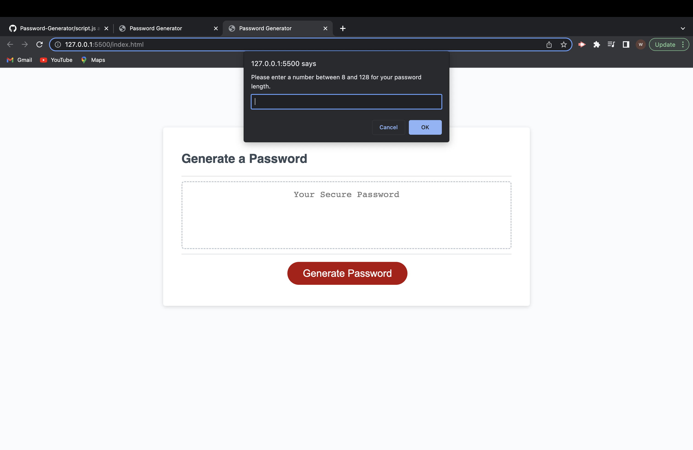

## alert-prompt-js-project

## Generator error
This Password Generator is not completed because I was not able to Figure out how to completly finish it. Although I was not able to completly finish the Acceptance Criteria I hope that this will be able to be used to help someone get on the right track if trying to figure out how to do the same thing.

## Description

I was given instructions along with existing code to finish creating a password generator that displays prompts and displays a random password based on your selections. When you click on the "Generate Password" button you will be prompt with a few questions that will then be used to create a random password using JavaScript.  

## Installation
N/A

## Usage

## Credits
I used the following videos to help me understand how to create a password generator.

https://www.youtube.com/watch?v=x4HUaiazDes&t=61s

https://www.youtube.com/watch?v=XOROiF-phnE
used for understanding for loops

Code was given and taken from...
https://github.com/coding-boot-camp/friendly-parakeet

## License
N/A